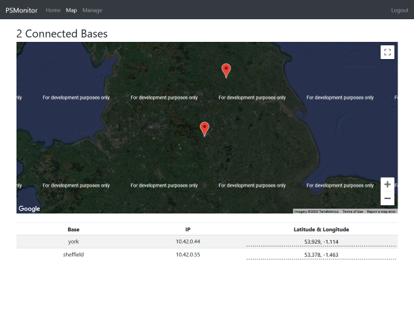
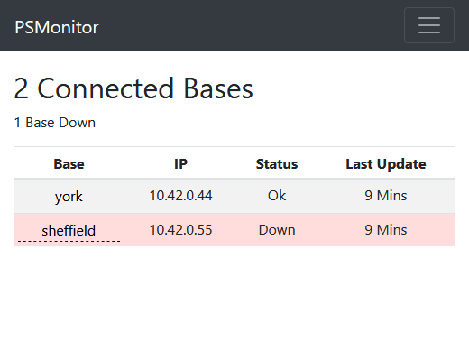

# EESproject
Web based monitor created during EES 2019/2020 for monitoring remotely connected IOT stations. I created this while working for Network Rail as part of the EES project assigned to our team.

 

## Goal
My goal for this project was to create an easy to use website for monitoring the status of powersupply units for railway systems. I chose a modern/sharp design style, with the help of bootstrap, when creating this tool so that it would feel at home along side other modern webapps. I used ejs to easily display the collected data as it arrived to the server as well as a custom built authentication systems to keep that data safe. 

## Challenges
This was the first time I used ejs for generating html elements so I had to become familiar with the syntax. Using ejs really helped to keep my code clean and effective which was a blessing compared with other alternative solutions.
